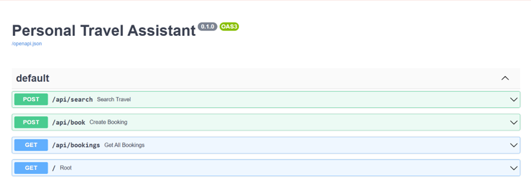
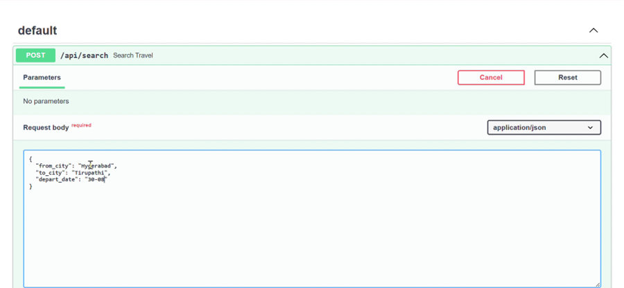
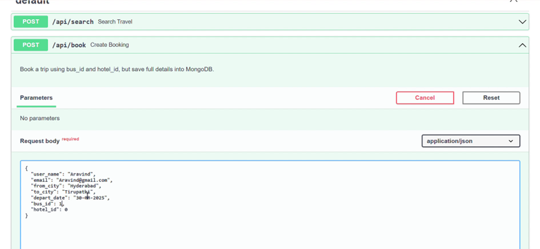
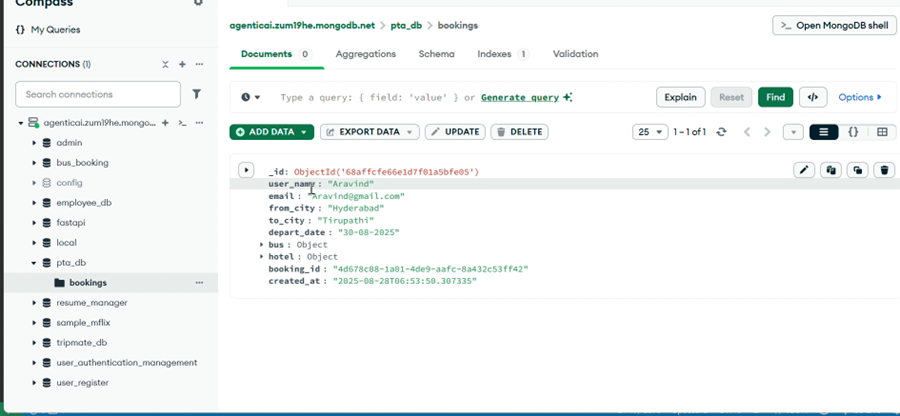

<div align="center">

</div>

# Personal Travel Assistant (PTA)

A smart **backend system** built with **FastAPI** and **MongoDB** that helps travelers plan their journey by combining **Weather Forecasts**, **Bus Availability**, and **Hotel Options** into one platform.  

---

## 📑 Use Case
The Personal Travel Assistant enables users to:
- Check **weather conditions** at the destination on the travel date.
- Get **suggestions** (e.g., carry umbrella, avoid traveling during heavy rain like postponing).
- View available **buses** (APSRTC, TSRTC, and Private operators).
- View available **hotels** (luxury, budget, homestay).
- Book a trip with **bus + hotel** in one step.
- Save all booking details in **MongoDB Compass** for future retrieval.

---

## 🚀 Features
- ✅ Destination search with **from_city, to_city, date**  
- ✅ Current & forecast **weather report + suggestions**  
- ✅ 5 buses (APSRTC, TSRTC, Private) with unique IDs  
- ✅ 5 hotels with IDs and details  
- ✅ Simple booking flow using **serial numbers**  
- ✅ Bookings stored in **MongoDB** with full details  
- ✅ View all bookings with user + travel + bus + hotel info  

---

## 🛠️ Tech Stack
- **Backend:** FastAPI (Python)  
- **Database:** MongoDB Compass  
- **Demo APIs Integrated:**
  - [Open-Meteo](https://open-meteo.com/) - Weather  
  - [MakCorps Free API](https://makcorps.com/) - Hotels  
- **Other Tools:** `motor` (Mongo driver), `httpx`, `dotenv`, `Uvicorn`  

---

## ⚙️ Setup Instructions
1. Clone the repo:
   ```bash
   git clone https://github.com/yourusername/PTA.git
   cd PTA

2. Create and activate virtual environment:
   ```bash
   conda
   conda create -n <environment_name>
   folder_path/conda activate  <environment_name>

3. Install dependencies:
   ```bash
   pip install -r requirements.txt

4. Configure .env:
   ```env
   MONGODB_URL=mongodb+srv://<your_mongodb_url>
   DB_NAME=pta_db
   HOTEL_API_URL=https://api.makcorps.com/free
   OPEN_METEO_BASE=https://api.open-meteo.com/v1/forecast

5. Run the app:
   ```bash
   uvicorn app.main:app --reload

6. Open Swagger docs:
    ```bash
   http://localhost:8000/docs

---
### API Endpoints

```
| Method | Endpoint   | Description                                |
|--------|------------|--------------------------------------------|
| POST   | `/search`  | Search destination (weather, buses, hotels)|
| POST   | `/book`    | Book bus + hotel (saves to DB)             |
| GET    | `/bookings`| Retrieve all saved bookings                |
```



#### The step by step execution of PTA using Swagger UI Pictorial:


- **search travel**
   
- **Booking process**
   

- **Final bookings retrieval**
  


# 💾 Sample JSON Response:

```json
{
  "count": 1,
  "bookings": [
    {
      "user_name": "Aravind",
      "email": "p.aravind854@gmail.com",
      "from_city": "Hyderabad",
      "to_city": "Tirupathi",
      "depart_date": "2025-08-30",
      "bus": {
        "operator": "APSRTC Express",
        "departure_time": "2025-08-30 06:00",
        "price": 500
      },
      "hotel": {
        "name": "Vijayawada Grand Hotel",
        "price_per_night": 2500,
        "rating": 4.2
      }
    }
  ]
}
```

# Conclusion
- ✅ PTA is scalable, production-ready, and client-focused.
- ✅ It integrates weather, buses, and hotels into one backend system.
- ✅ Suitable for real-time travel planning and extendable for production use.